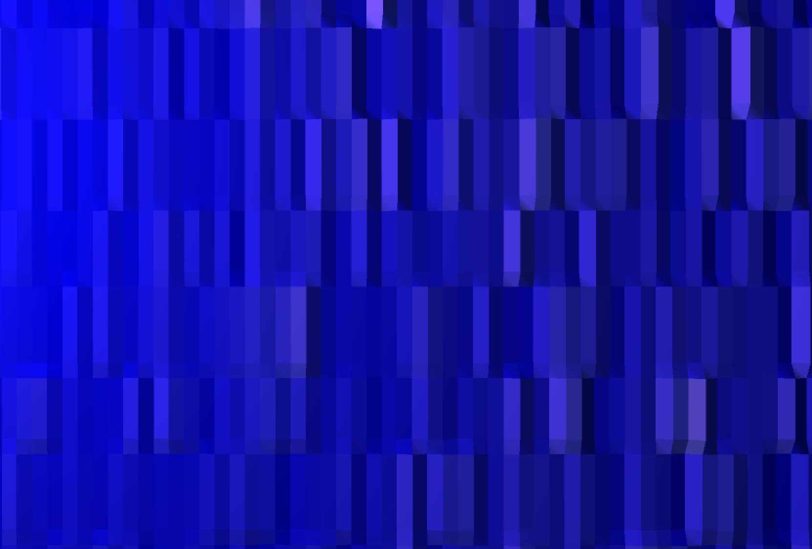
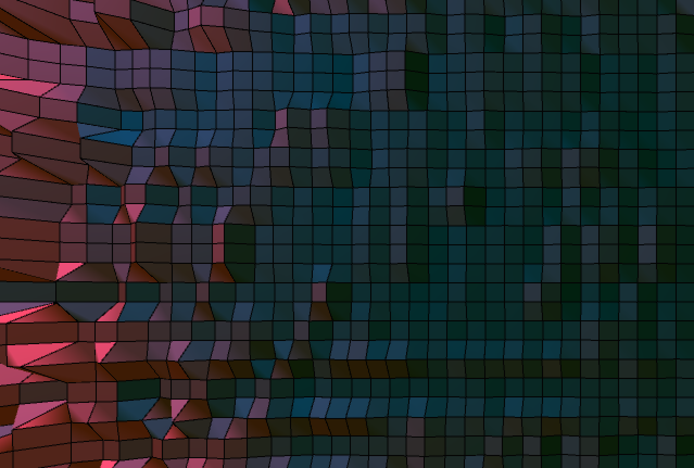

Sampling sounds from nature such as volcanos, birds, and forest soundscapes, this visual experiment explored the transient nature of noise and the relationship between volume and texture. Colors were selected based on algorithmic rules to match the source of the soundscape.

The series was arranged around a table with several laptops running the simulations live during exhibition.

