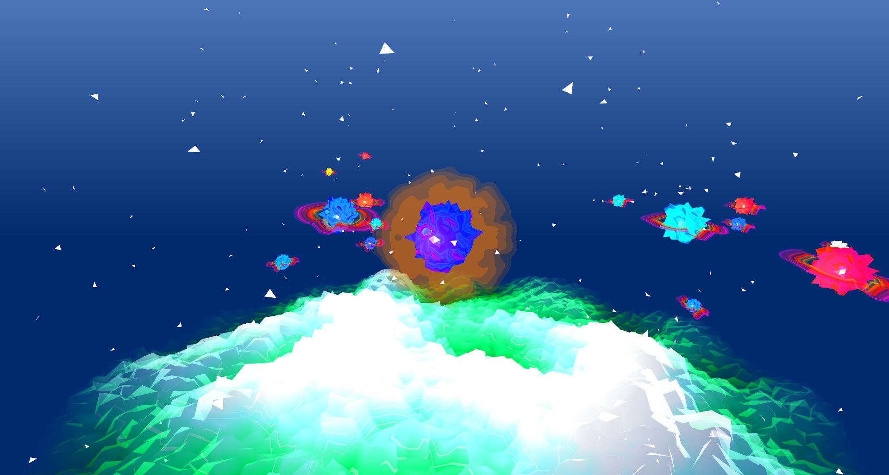
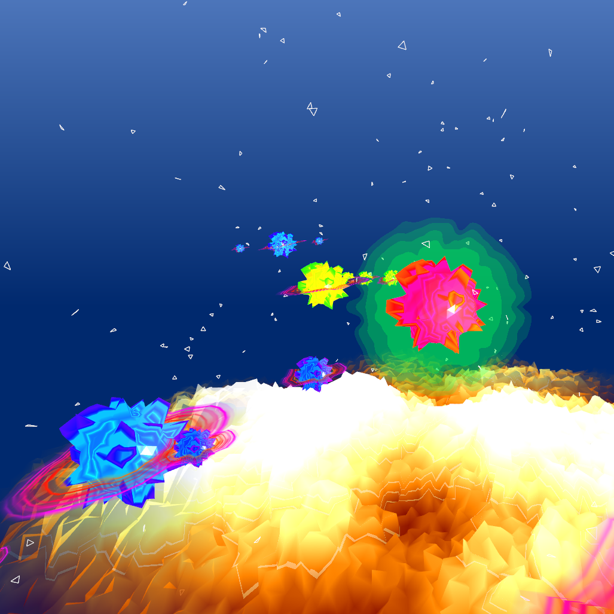

Spiky is a 3D visualization of music set in outer space. Abstract planets, stars and shapes orbit each other to the tempo of the music. Properties of the music such as pitch and volume affect shaders. This project was created using Open Frameworks.

